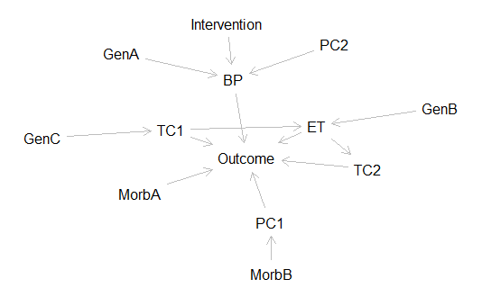

```{r setup, include=FALSE}
knitr::opts_chunk$set(echo = TRUE)
library(dagitty)
```

# Abstract 

Clinical trials are often conceptually divided into those which are explanatory and those which are pragmatic, or in simple terms those answering the questions "how does it work?" and "which works better?", respectively. We believe that a pragmatic trial generates large amounts of high quality mechanistic information which is not commonly used, either in the course of the trial to inform safe delivery of the intervention, or in the design of future trials. We propose for the first time a method to combine two powerful inferential concepts via network theory: responsive adaptive randomisation within a clinical trial, and causal network production. We believe that this may allow pragmatic trials to clarify the mechanisms at work either to explain the observed results within the explanatory paradigm, or to modify treatments during the course of the trial while still allowing reliable inference. 

# Inference and prediction 

On observing an unwanted **outcome**, such as disability or death, it is natural to consider why it came about. In the language of Epidemiology, we might ask what **exposures** acted on the individual or population to **cause** the outcome. Data alone cannot answer these **causal** questions. A causal model is needed and is implicit in every data analysis. If every potential cause can be known with certainty, then data and a causal model are sufficient, but this is almost never the case for relevant biological questions: we also need to account for the uncertainty introduced by things that are not observed. This is elegantly accomplished using the laws of **probability**. 

If we combine data, a causal model and probabilistic reasoning we can **infer** causation and answer fundamental questions about how our world works. We can thus explain new phenomena, invent new approaches and solve old problems. Deduction, induction and abduction are ancient names for methods of inference which are innate to humans, have served us well and have much more to offer when harnessed within clinical trials rather than externally to them.  These inferential methods use different parts of data, with different causal models. We do not always make these explicit, and some are illustrated here. 

```{r echo=FALSE, message=FALSE, fig.cap='Inferences'}
gb <- dagitty( "dag {
    Exposure -> Effect -> Outcome ;
    Exposure -> Deduction <- Effect ;
    Exposure -> Induction <- Outcome ;
    Effect -> Abduction <- Outcome 
}")
plot(graphLayout(gb))
```

\newpage 

1. If a candidate exposure is already identified, we might ask whether it caused some or all of the outcome. \ref{fig:deduction} 

```{r deduction, echo=FALSE, message=FALSE, fig.margin = TRUE, fig.cap = 'Causal deduction'}
deduce <- dagitty(("dag {Exposure -> Outcome ;
                Exposure -> Observation <- Outcome; 
                Observation -> Deduction -> Outcome}"))
plot(graphLayout(deduce))
```

2. If an exposure is known to be associated with the outcome, might it be causal, or might some or all of its apparent effect be due to a **confounder**? \ref{fig:confounding}

```{r confounding, echo=FALSE, message=FALSE, fig.margin = TRUE, fig.cap = 'Confounding'}
confound <- dagitty(("dag {Exposure -> Outcome ;
                Exposure -> Deduction <- Effect1 ; 
                ConfounderA -> Effect1 -> Outcome ; 
                ConfounderB -> Effect2 -> Outcome}"))
plot(graphLayout(confound))
```

3. A subtly similar question is whether, having decided that the exposure causes the effect, it does so via one or another postulated **mechanism**. \ref{fig:mechanisming}

```{r mechanisming, echo=FALSE, message=FALSE, fig.margin = TRUE, fig.cap = 'Mechanism'}
mechanism <- dagitty(("dag {Exposure -> Effect -> Outcome ;
                Exposure -> Induction -> Outcome ; 
                Exposure -> Effect -> Induction -> Outcome}"))
plot(graphLayout(mechanism))
```

As described, for example by Pearl, all of these questions require both probabilistic reasoning and causal assumptions expressed in a causal model. The answer to such a question is variously called an inference, an estimate or a prediction, with preference for one term over another often being dependent on the field of work of the investigator. In homage to this tribalism we use the term **inference** to mean a statement about the causal effect of an exposure on an individual or population, viewed in terms of a clearly specified outcome and using techniques to account for confounders. 

Inference using observational data is difficult, because it is uncertain.  The causal model required for inference may be wrong and it is difficult to decide its veracity.  The word "**confounder**" implies that some of the observed outcome for a given exposure is not causally due to that exposure itself but is instead "confounded by" or due to another mechanism^[Which is usually assumed to be causal, but may never have been, and may only be an artefact of a method of measurement. This may need to be left out for general, or expanded for Epi, audiences.]. Even if the model is correct, it may not be possible to observe all of the exposures along with the potential confounders of each exposure.  In these situations, further simplifying assumptions might be needed in order to make any inference at all.  

Powerful and elegant methods allow us to use observed distributions of outcomes to summarise the totality of effects.  We then refer to the data generating **distribution** regardless of the many underlying, and mostly unobserved, data generating *mechanisms*. The further we move from a deterministic causal model, however, the more we accept that our inferences only refer to, and may not represent, reality. Such an influence on the estimate may be called **bias**. This leads to uncertainty that simply cannot be removed or bounded using probabilistic methods, with the spectre of the so-called "Type III error". 

**Randomised controlled trials** (RCTs) are powerful tools for inference. Randomisation permits the highest quality of causal inference about the effect of an intervention on an outcome. At the time of allocation - but not necessarily for ever - the level of all confounders whether observed or unobserved is balanced by randomisation. Randomisation also makes it possible to place bounds on the expected range of outcomes, using a model of the sampling distribution and how it relates to the underlying **probability distribution** of the outcome in the population under study. Having simplified the causal model to its simplest canonical form, and holding all confounders constant by means of randomisation, a question can be answered about a sample. Deliberate allocation to an exposure is important in forming the causal model and the means of allocation is important to address bias^[Again, there are other allocation schemes and Epi audiences might twig to this bit and so need palliation by referring to those other characteristics.]. In recognition of the special place this exposure holds by means of deliberate allocation we refer to it as the **intervention**. If the effect of the intervention in the sample is transferrable to future populations then so is the answer. 

# Rationale 

There are, however, times when RCTs leave further questions. Suppose a parallel group randomised trial of a single well specified intervention is conducted. There is overall no apparent effect of the intervention. A suspicion arises that the timing or intensity of the intervention was not optimal, that there may be **differential** effects in certain subgroups, that the effect requires an **interaction** with other exposures for its effect or that the effect is **heterogenous** within groups proportional to some continuous parameter. There are several options: 

- The intervention may be altered 
- The groups may be defined further 
- The suspected interacting or confounding parameter may be measured and used for titration 

These all require confirmation in further studies, most powerfully RCTs.  The parallel group RCT imposes limitations in this situation, because of the difficulty and expense in iterating to the best treatment protocol. Even when a simple, direct mechanism links diagnosis to efficacy, it is **barely feasible** to choose the right intensity and right time to apply the intervention to the right patients on the first run. When the intermediate measures are themselves only proxies for deeper interactions it is unlikely that the true effect of the intervention will be either demonstrated or clarified. These limitations are defined by the design of the trial, meaning that more trials are needed to follow up the results. RCTs are, however, so expensive and burdensome to run that a single large trial may remain the only evidence for many years even in the persistence of these causal questions. 

In recent years more efficient designs have been described which may give information about several types or intensities of intervention, or observe several patient groups. **Adaptive** designs change allocation probabilities for future enrolments using information from prior participants, and may do so for all of these aspects of the intervention.  The **efficiency**^[It is easier to define the "efficiency" of a trial in general terms than to agree how to compute it: a trial which recruits fewer participants, allocating fewer of them to a less effective intervention, is more efficient.] of these designs is often greater than that of an individual parallel group trial without adaptation[berry_bayesian_2010]. These gains are not guaranteed in the simplest situation, but are realised with exponentially greater odds as the design simultaneously compares more combinations of intervention and population. 

# Simulation 

These trials gain their formal acceptability to those trained in frequentist methods by being able to reproduce the **error characteristics**^[After Neyman the Type 1 error is roughly speaking the "false positive" probability in a null population which is like the trial population at baseline, the Type 2 error being the "false negative" probability ] of frequentist designs.  Because there is most often no analytic method for the complex sampling distributions created by adaptation, error characteristics are derived by simulation. If every reasonable series of patients, under every reasonable hypothesis for effect, has been simulated before starting the trial, then the rate of false declaration of effect, or false declaration of no effect, is known. This knowledge is achieved by stating all the interventions, in every combination, and their likely behaviour in plausible participants, as strong assumptions. 

The apparent frailty of this procedure is balanced by the fact that tens of thousands of simulations are run using *other* hypotheses of effect, between which there is **sufficient variation** to reflect the true range of possible situations.  In proportion to the information distance between each hypothesis, this simulation procedure makes the trial performance less dependent on the truth of any one hypothesis^[This is just an assertion, without reference or proof and so is actually a hypothesis. But I suspect it's true.]. 

# Causal reasoning 

Despite the efficiency gained by these or future designs there remains a limit to the *types* of inference that are possible. In all of the scenarios discussed, the plausible effects of each intervention have been described using information external to the trial and the results of the trial are interpreted using a causal framework that is also predetermined, external to the trial and not modified in the trial. 

This is a shortfall in the current ambition of adaptive trials which is similar in magnitude to the gap which previously existed before they supplemented Fisher-Neyman-Pearson parallel group trials. Because **trials are questions**, it is useful to demonstrate these ambitions as questions. 

1. Which intervention results in a better outcome in this population? 

- Estimated from the observed effect in a sample, in which the intervention is deliberately allocated. Because no other exposures with potentially causal effects are allocated by design, and may be the reasons for some of the observed outcome, they are confounders. Randomisation balances these, removing their effect in the long run; probabilistic reasoning thence allows the size of their random imbalances to be bounded in each realisation of the trial. Inference on why a certain result is obtained occurs after the trial is entirely finished, and information about alternative interventions or populations requires both causal models and probabilities which are entirely external to the trial. 

2. What is the effect of this intervention in this population? 

- Estimated from the observed effect in a sample, where the outcome without the intervention is able to be estimated. The intervention effect is isolated from all other effects. This requires comparison to placebo or powerful methods for bias removal. This strictly provides an answer to the question *only as phrased*. Information on alternative interventions, or in other populations, may be inferred if the causal model decrees that placebo results are transferable and that the probability distribution can be integrated with that from an external set of data. Again, that causal-probabilistic model and the alternative intervention data are external to the trial. 
    
3. How do we design the best intensity or timing of this intervention in this population? 
- Estimated from the range of effects for a range of interventions, again where the outcome without intervention can be estimated. A multi-arm trial with placebo arms, with a causal model which extrapolates the observed effect at given intensities to a potentially unobserved optimal intensity, is capable of estimating this question.  The causal model, notably, remains outside the trial. 

4. How do we design the best balance of intensity or timing across populations, minimising harms? 

- Estimated from the design in number 3, above, with separate estimation in a variety of populations.  The causal model requires not only that the intervention but any relevant confounders and interactions are completely specified across all future populations to whom the results will be applied. The probabilistic model requires that **sufficient variation** has been observed to anticipate whether such models apply to a future population.  

--- This is a subtle point and probably needs more lead-in above.

5. How do we use new components of the intervention or respond to interactions that did not previously exist? 

- This requires that each component of the model is separately, explicitly, assessed for its interaction with others, in a causal framework that allows the resulting data on outcomes to be assessed at the time of meeting each new threat or **candidate solution**, to decide whether the previous lessons can apply. A causal model required for these decisions exists in the mind of subject area specialists and has only rarely been defined in a way that permits testing such questions. 

# Algorithmic Causal Enrichment (ACE) 

The problem identified in inference step 5 above is essentially "why did the index trial work?" (or more likely if applied to intensive care research, "why did it *not* work?"). At this stage it is customary to put down the tools of randomised inference after the index trial and to start again. This revisit of mechanisms is external to the trial and hence entails discarding the sublime and immense power of randomisation, treating all the observed patient data as no more than carefully collected observations. The revisit involves technology of blinding complexity and often prompts epochal discoveries, both external and irrelevant to the trial.  

By starting that revisit with a single trial answer and ignoring the mechanistic insights of a trial, or worse by failing to design the trial specifically to answer mechanistic questions, we fail to use these complements to come up with a complete sentence: "This intervention had no overall effect, because the effect depends on a factor for which we may now design a bedside test to direct the intervention, or design a co-intervention to make it effective in all". 

We propose a visually simple explanation for a trial algorithm to complete this sentence, by delivering this level of mechanistic insight in the context of a randomised trial. The basic function of the algorithm is to modify the strength or existence of links in a causal diagram using information from participants as it accrues. As a necessary effect of that behaviour this Algorithmic Causal Enrichment does not only provide unbiased estimates of the effect of individua components of the intervention, or perhaps more usefully of pathways through an intervention network. It also determines the optimal pathway for populations defined by combinations of characteristics. 

Participants are randomised to be allocated to pathways through the diagram.  The simple diagram in fig 4 demonstrates that response adaptive randomisation to a predetermined relatively complex intervention with unchanging characteristics can already be viewed in this way, and once the trial is completed the strengthening of causal links is dissected in analysis. The modification in our proposed **algorithmic causal enrichment (ACE)** is to adapt the probability of allocation to individual parts of the complex pathway. The single complex intervention is replaced by a **pathway** or combination of its components, with bounds placed on the permitted combinations using probabilities of 0 or 1 which are not permitted to change. 

A patient with ARDS is randomised to a ventilation strategy. The rationale for this is articulated in a causal diagram fig 4. It is hypothesised that the APRV mode improves outcomes and this is the single relationship tested in current trial designs. Using these current designs the effect of APRV on intermediate steps is observed, but not controlled by allocation. Using **ACE**, however, these intermediate steps are targeted whether they are allocated or simply observed. In the diagram, APRV maintains lung recruitment for a given mean airway pressure and hence reduces the deformation of partially collapsed lung units, protecting them from atelectrauma and reducing both the local inflammation which causes progressive lung injury and the systemic inflammation which leads to distant organ damage. This relationship is detected as a strengthening of all the edges along the described pathway, and a corresponding weakening of the edges along alternative pathways. The probability of allocation to any node that occurs along the pathway is increased as the product of the path coefficients between that node and connected nodes which are available for allocation. 

Now, it may be possible to randomise only to the *first step* of the pathway: in such a case the first few allocations are identical to the procedure for a parallel group trial which allocates to treatments with a fixed probability. This is also true for response adaptive randomisation using the outcome or a surrogate. Even in the simplest case of 1:1 parallel group randomisation, however, the proposed **ACE** procedure will not only result in a gradually increased probability of allocation to the effective arm - as does RAR and with similar efficiency - but provide a causal diagram containing diagnostic information on *why* the allocation produces (or in the case of ICU trials fails to produce) an influence on the outcome. 

# The explanatory diagram 

A particular strength of **ACE** is in producing a diagram. The diagram does not only display the outcome that results from allocation to a given treatment, but explains the necessary factors for a successful outcome, whether they be measured patient characteristics at baseline, levels of response to elements of treatment, or interactions between these and the allocated intervention. 


This may be used to interpret the reasons for the result of the trial. If, by the trial protocol, there can be some influence over any of the nodes in the pathway then the **ACE** procedure truly functions as an enrichment. Patients who are more likely to benefit are thereby allocated more certainly to the successful arm, critical factors for safety or success in delivering the intervention are immediately apparent, and patients are allocated more certainly to these elements of best practice. The procedure also permits clinicians to intuit these critical factors, which clearly threatens blinding; at the same time it permits clinician choice at each decision point and *still converges on the best outcome*. This influence of clinician choice may be handled naively, by simply treating each node as being present, or there may be different representations of nodes allocated by algorithm and those allocated by clinician choice (perhaps overriding the algorithm's recommendations). In the end this is likely to increase enthusiasm and trust among the clinicians during the trial's course, and improve the process of implementing the results of the trial for improved patient outcomes, without threatening the trial's validity of interpretation. 

# Biologically relevant groups 

This design copes inherently with the concept of differential treatment effect between subgroups. This is also often called "heterogeneity of treatment effect", which is perhaps better reserved for a gradient of efficacy within a single group, as predicated on a continuous variable. Whether group membership is a binary variable, or multivariable characteristics of individuals are given as a vector of categorical or continuous variables, these may be included in the model without further modification. 

The technique is not to allow individuals or groups to appear as nodes unless group membership is truly thought to be the sole determining characteristic of responses to treatment and circumstances. Instead, the covariates in a model appear as nodes influencing various parts of the estimate, which translate directly to "group membership" only to the extent to which it is biologically relevant to the question at hand^[With the side effect of being un-racist. I had intended to draw up examples here but there is no pre-written software. Later.].

```{r echo=FALSE, message=FALSE, fig.cap='Initial diagram. BP = blood pressure, ET = Endotoxin load, Gen = Genptype, Morb = Comorbidity, TC = RNA transcript under relevant physiological conditions, PC = RNA transcriptome principal component 1, '}
#gb <- dagitty( "dag {
#    BP -> Outcome ;
#    Intervention -> BP;
#    GenA -> BP ;
#    GenB -> ET -> Outcome ;
#    GenC -> TC1 -> Outcome ;
#    MorbA -> Outcome ; 
#    MorbB -> PC1 ; 
#    ET -> TC2 -> Outcome ;
#    PC1 -> Outcome ; 
#    PC2 -> BP ; 
#    TC1 -> ET ; 
#    TC2 -> Outcome 
#}")
#plot(graphLayout(gb))
#
```
